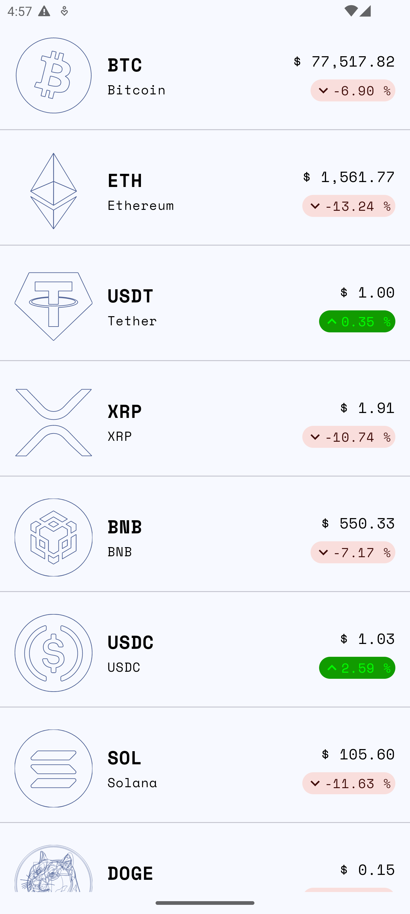
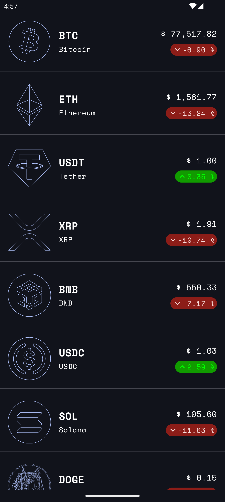
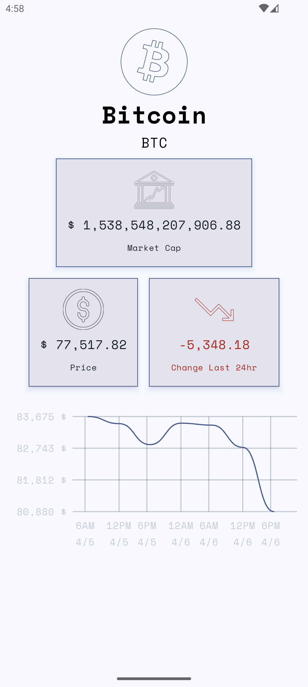
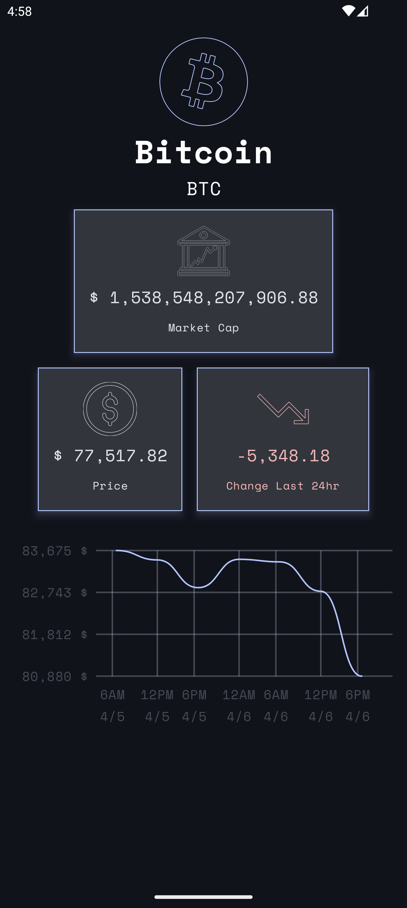
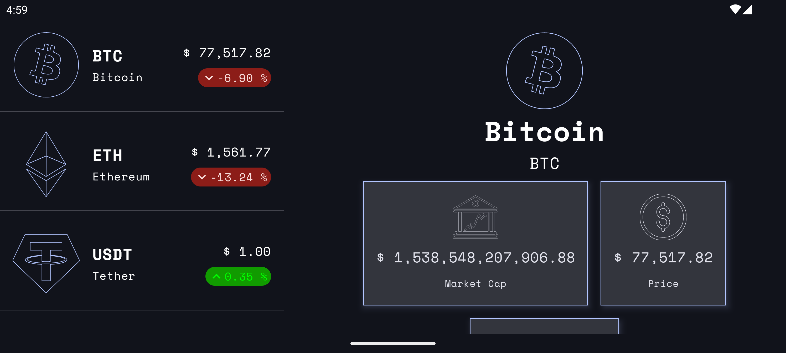

# CryptoTracker

CryptoTracker is an Android application that allows users to track cryptocurrency prices and view detailed information about various coins. It provides a user-friendly interface to stay updated on the dynamic world of cryptocurrencies.

## Features

*   **Coin Listing:** Displays a comprehensive list of cryptocurrencies, including their symbols, current prices, and price change percentages.
*   **Coin Details:**  Provides detailed information about a selected cryptocurrency, such as:
    *   Historical price data (represented in a line chart).
    *   Market capitalization.
    *   Last 24Hours change is price,
*   **Adaptive Layout:** The app adapts its layout to different screen sizes and orientations for an optimal user experience on various devices.
*   **Modern Android Development:** Built using modern Android development tools and libraries, including Jetpack Compose for UI, ensuring a responsive and maintainable codebase.

## Screenshots

_A screenshot of the main coin list._

_A screenshot showing the detailed information for a specific coin._

 _(Optional) A screenshot demonstrating the adaptive layout on a different screen size or orientation._
